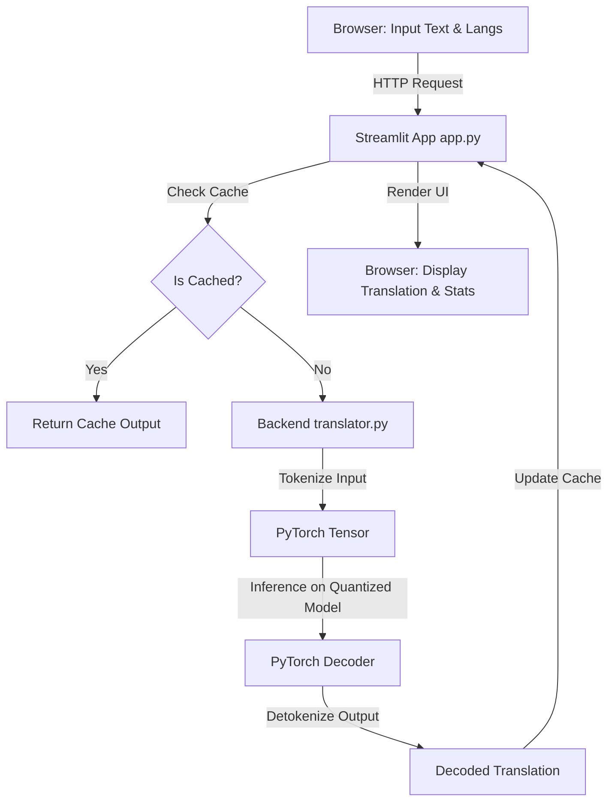

# AI Translation Application Implementation Plan

This document outlines the technical plan for building a local, privacy-centric Neural Machine Translation (NMT) web application using Python, Hugging Face Transformers, PyTorch, and Streamlit.

## User Review Required

> [!IMPORTANT]
> **Model Selection & Disk Footprint**
> We plan to use `facebook/m2m100_418M` as the default model. It supports translation between 100 languages directly without going through English as an intermediary. 
> - **Size on disk**: ~1.9 GB.
> - **RAM usage**: ~1.6 GB (unquantized), which drops to **~500 MB** under PyTorch 8-bit dynamic quantization.
> - Since your requirement is a minimum of **2GB free disk space**, this model fits just under the limit. If you have less space, we can configure a fallback to smaller bilingual models (like `Helsinki-NLP/OPUS-MT` models, which are ~300MB each) or a smaller multilingual model. Let us know if you prefer to proceed with `facebook/m2m100_418M`.

> [!TIP]
> **Performance Optimization (Quantization)**
> We will implement **PyTorch Dynamic Quantization** (`torch.quantization.quantize_dynamic`) targeting linear layers in the transformer. This will:
> 1. Compress the model's memory footprint by approximately **60-70%** at runtime.
> 2. Accelerate CPU inference latency significantly (up to 2x speedup on typical CPUs) with negligible loss in translation quality.

## Proposed Changes

We will create the following files in the project workspace `c:\Users\akand\Desktop\peter (project)`:

### Dependencies & Setup

#### [NEW] [requirements.txt](file:///c:/Users/akand/Desktop/peter%20(project)/requirements.txt)
Specifies all Python package dependencies needed for Hugging Face inference, PyTorch execution, and the Streamlit frontend.

### Backend logic

#### [NEW] [translator.py](file:///c:/Users/akand/Desktop/peter%20(project)/translator.py)
Encapsulates all machine learning logic:
- Loading model and tokenizer via Hugging Face.
- Applying dynamic quantization (`torch.quantization.quantize_dynamic`).
- Handling language code mapping (e.g., mapping user-selected languages to `facebook/m2m100_418M` locale codes like `es` for Spanish, `zh` for Chinese, etc.).
- Providing a thread-safe inference function that tokenizes the source text, generates translations, and decodes the outputs.

### Frontend Presentation Layer

#### [NEW] [app.py](file:///c:/Users/akand/Desktop/peter%20(project)/app.py)
The primary Streamlit application script containing:
- Application layout (Title, AI/Ethical disclaimer, sidebar options).
- Interfacing with `translator.py` using Streamlit's `@st.cache_resource` for model loading and `@st.cache_data` for translation query caching.
- Text input forms with auto-clear and word/character counters.
- Advanced settings toggle (quantization toggle, model selection).
- Execution statistics panel (latency, characters/sec).
- Inclusion of custom CSS styles.

#### [NEW] [styles.css](file:///c:/Users/akand/Desktop/peter%20(project)/styles.css)
Custom CSS styling to override default Streamlit themes, creating a premium interface:
- Modern typography and glassmorphic card containers.
- Sleek custom text areas with focus glows.
- Smooth hover animations on action buttons.
- Distinct color-coded badges for translation metrics.

### Project Documentation

#### [NEW] [README.md](file:///c:/Users/akand/Desktop/peter%20(project)/README.md)
Provides instructions on how to set up the local virtual environment, install dependencies, download models (first-time run), and run the application offline.

---

## Data Flow Pipeline



---

## Verification Plan

### Automated Verification
We will run a test script (`test_translator.py`) to verify that:
1. The model can download and load properly.
2. The quantization runs successfully on the CPU.
3. Translation executes and returns coherent output between the target languages (English, Spanish, French, German, Chinese).

```powershell
# Commands to verify environment and run app/tests
python -m venv venv
venv\Scripts\activate
pip install -r requirements.txt
python test_translator.py
streamlit run app.py
```

### Manual Verification
1. Open the application in the web browser.
2. Translate text between multiple language combinations:
   - English -> Spanish
   - English -> Chinese (Simplified)
   - French -> English
3. Toggle "Dynamic Quantization" under Advanced Settings to observe differences in translation latency and memory usage.
4. Verify the user interface layout, CSS styles, and responsive design across desktop and mobile sizes.
